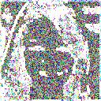
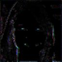
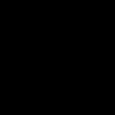
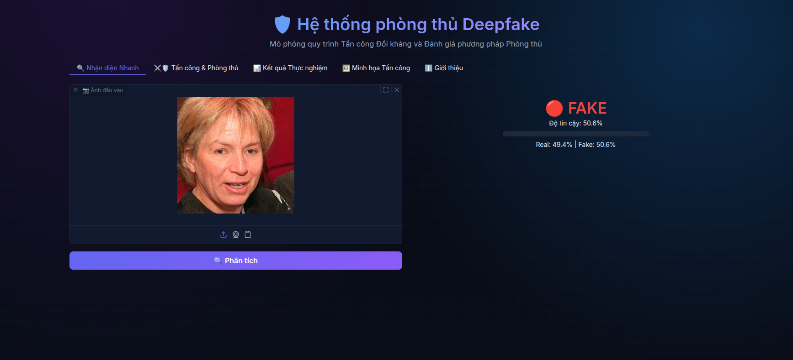
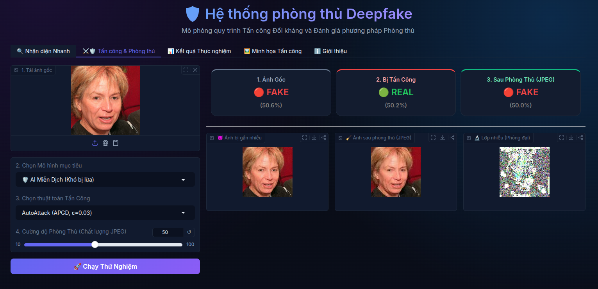
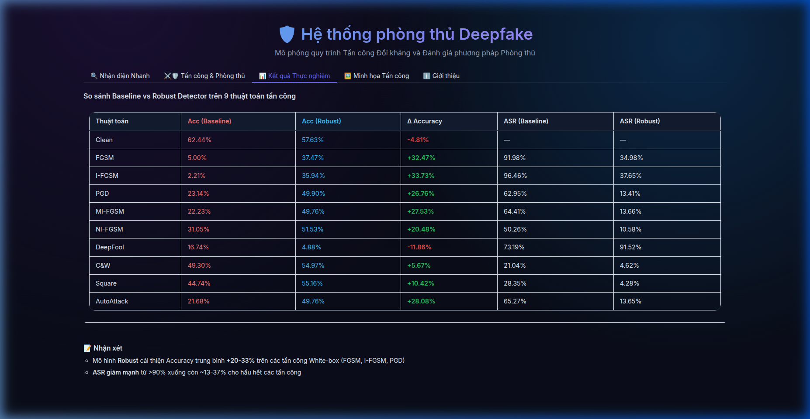
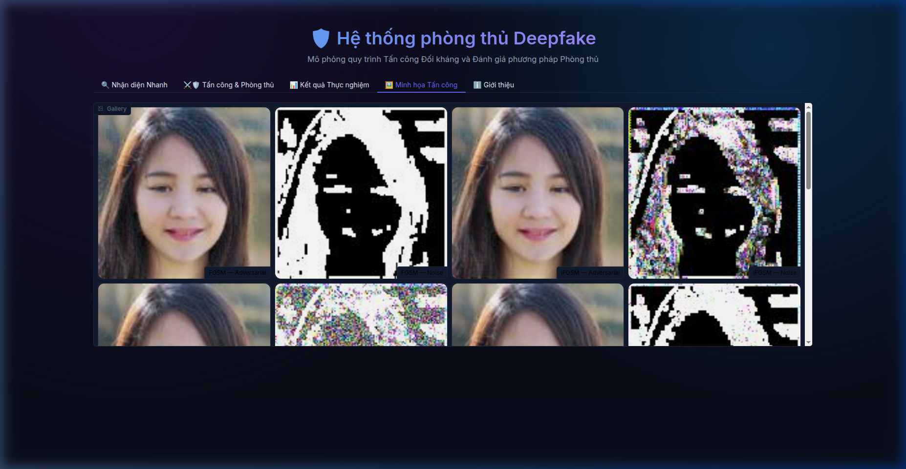

# Nghiên cứu Phòng thủ Tấn công Đối kháng trên Mô hình Nhận diện Deepfake

Dự án này tập trung nghiên cứu sự suy giảm hiệu suất của các mô hình phát hiện Deepfake trước các cuộc tấn công đối kháng (Adversarial Attacks) và đánh giá hiệu quả của các phương pháp phòng thủ (Adversarial Defenses).

---

## 1. Dữ liệu
Sử dụng bộ dữ liệu **140k Real and Fake Faces**:
- **Train:** 100,000 ảnh
- **Validation:** 20,000 ảnh
- **Test:** 20,000 ảnh

Tập dữ liệu bao gồm khuôn mặt người thật và khuôn mặt giả mạo (Fake) được tạo ra từ StyleGAN. Trong pipeline, tập Train và Valid được gộp lại (120,000 ảnh) để tối đa hóa hiệu suất huấn luyện mô hình.

## 2. Các phương pháp Tấn công Đối kháng
Dự án đánh giá độ bền vững của mô hình trên **9 thuật toán tấn công** khác nhau, được triển khai thông qua thư viện `torchattacks`, chia làm các nhóm:
- **Gradient-based (White-box):** FGSM, I-FGSM, PGD, MI-FGSM, NI-FGSM
- **Optimization-based (White-box):** Carlini-Wagner (C&W), DeepFool
- **Black-box:** Square Attack
- **Ensemble:** AutoAttack (APGD-CE + Square)

## 3. Các phương pháp Phòng thủ
- **Tiền xử lý (Preprocessing):** Áp dụng bộ lọc nén JPEG (JPEG Smoothing - Quality=75) để phá vỡ các nhiễu đối kháng tần số cao.
- **Huấn luyện đối kháng (Adversarial Training):** Đưa trực tiếp các mẫu đối kháng (Adversarial examples) được sinh ra từ PGD vào quá trình huấn luyện để tăng cường độ bền vững của mạng neural.

---

## 4. Kết quả Thực nghiệm

Dưới đây là kết quả đánh giá sự sụt giảm hiệu năng của mô hình cơ sở (Baseline) khi bị tấn công đối kháng trên tập Test (20,000 ảnh):

| Tình trạng / Thuật toán | Accuracy | F1-Score | ROC-AUC | Attack Success Rate (ASR) |
|-------------------------|----------|----------|---------|---------------------------|
| **Clean (Không bị tấn công)** | 62.44% | 60.19% | 66.86% | - |
| **FGSM** | 5.00% | 4.62% | 1.12% | 91.98% |
| **I-FGSM** | 2.21% | 1.96% | 0.28% | 96.46% |
| **PGD** | 23.16% | 20.00% | 14.23% | 62.92% |
| **MI-FGSM** | 22.23% | 19.22% | 13.30% | 64.41% |
| **NI-FGSM** | 31.05% | 28.87% | 23.61% | 50.26% |
| **DeepFool** | 16.74% | 0.32% | 1.60% | 73.19% |
| **Carlini-Wagner (C&W)**| 49.30% | 45.88% | 63.25% | 21.04% |
| **Square Attack** | 44.74% | 46.60% | 56.14% | 28.35% |

> **Nhận xét:** Mô hình cơ sở (Baseline) rất dễ bị tổn thương trước các cuộc tấn công White-box (đặc biệt là I-FGSM và FGSM), làm giảm độ chính xác từ 62.44% xuống chỉ còn 2-5% với Tỷ lệ tấn công thành công (ASR) lên đến >90%. Các tấn công tối ưu hóa như DeepFool cũng làm suy giảm nghiêm trọng F1-Score về gần bằng 0.

### 4.2. Hiệu quả của Adversarial Training

Sau khi áp dụng phương pháp Adversarial Training (huấn luyện trên tập dữ liệu đã trộn lẫn ảnh nhiễu PGD), dưới đây là sự cải thiện rõ rệt về độ bền vững của mô hình trên tập Test:

| Tình trạng / Thuật toán | Accuracy (Baseline) | Accuracy (Robust) | ASR (Baseline) | ASR (Robust) | Cải thiện Accuracy |
|-------------------------|---------------------|-------------------|----------------|--------------|-----------|
| **Clean**               | 62.44%              | 57.63%            | -              | -            | -         |
| **FGSM**                | 5.00%               | 37.47%            | 91.98%         | 34.98%       | 🟢 +32.47% |
| **I-FGSM**              | 2.21%               | 35.94%            | 96.46%         | 37.65%       | 🟢 +33.73% |
| **PGD**                 | 23.14%              | 49.90%            | 62.95%         | 13.41%       | 🟢 +26.76% |
| **MI-FGSM**             | 22.23%              | 49.76%            | 64.41%         | 13.66%       | 🟢 +27.53% |
| **NI-FGSM**             | 31.05%              | 51.53%            | 50.26%         | 10.58%       | 🟢 +20.48% |
| **DeepFool**            | 16.74%              | 4.88%             | 73.19%         | 91.52%       | 🔴 -11.86% |
| **C&W**                 | 49.30%              | 54.97%            | 21.04%         | 4.62%        | 🟢 +5.67%  |
| **Square Attack**       | 44.74%              | 55.16%            | 28.35%         | 4.28%        | 🟢 +10.42% |
| **AutoAttack**          | 21.68%              | 49.76%            | 65.27%         | 13.65%       | 🟢 +28.08% |

> **Nhận xét:** Mô hình Robust cho thấy sức chịu đựng tuyệt vời trước hầu hết các phương pháp tấn công White-box (như PGD, I-FGSM, AutoAttack), duy trì được Accuracy ở mức chấp nhận được và giảm thiểu rất mạnh Tỷ lệ tấn công thành công (ASR). Riêng đối với DeepFool, việc sử dụng hàm loss khác biệt khiến thuật toán này có khả năng "lách" qua lớp phòng thủ PGD (regression), đòi hỏi các phương pháp ensemble defense phức tạp hơn trong tương lai.

---

## 5. Minh họa Tấn công Đối kháng

Một khi mô hình bị tấn công, bức ảnh Deepfake gốc sẽ bị cộng thêm một lớp nhiễu đối kháng (perturbation/noise). Lớp nhiễu này vô cùng nhỏ gọn nhưng được tối ưu hóa bằng thuật toán gradient để đánh lừa mạng neural nhận diện nhầm ảnh giả mạo thành ảnh thật (Real). Bằng mắt thường, con người gần như không thể nhận ra sự thay đổi này.

*(Lưu ý: Các hình ảnh bên dưới sẽ hiển thị sau khi bạn chạy script sinh ảnh mẫu và lưu vào thư mục `reports/samples/`)*

| Ảnh gốc (Fake) | Lớp nhiễu / Perturbation (Được phóng đại) | Ảnh đối kháng (Mô hình nhận diện sai là Real) |
|:---:|:---:|:---:|
|  |  |  |
|  |  |  |
|  |  |  |

---

## 6. Demo Giao diện Tương tác (Gradio)

Dự án cung cấp một ứng dụng web tương tác trực quan sử dụng thư viện **Gradio**. Giao diện này tích hợp toàn bộ pipeline mô phỏng tấn công đối kháng, phòng thủ JPEG Smoothing và so sánh trực tiếp hiệu quả của các cấu hình mô hình khác nhau.

### 6.1. Các Mô hình hỗ trợ
Ứng dụng tải song song 3 phiên bản mô hình phát hiện:
1. **TinyCNN Thường (Baseline):** Mô hình cơ sở chưa được huấn luyện đối kháng (dễ bị tấn công).
2. **TinyCNN Miễn Dịch (Robust):** Mô hình đã qua huấn luyện đối kháng bằng PGD.
<!-- 3. **DINOv2-MAC (Large Vision Model):** Mô hình chưng cất đặc trưng đa khía cạnh (Multi-Aspect Classification) kết hợp DINOv2 backbone với Register Tokens. -->

Hệ thống hỗ trợ mô phỏng **11 biến thể tấn công** từ 9 nhóm thuật toán đã nghiên cứu (FGSM, I-FGSM, PGD, MI-FGSM, NI-FGSM, DeepFool, C&W, Square, AutoAttack).

---

### 6.2. Các Chức năng chính

#### 🔹 Tab 1: Nhận diện Nhanh
Cho phép tải lên một bức ảnh khuôn mặt bất kỳ, chọn mô hình mong muốn để phân loại **Real / Fake** cùng thanh biểu diễn độ tin cậy (confidence score) trực quan.

<p align="center">
  
</p>

#### 🔹 Tab 2: Tấn công & Phòng thủ (Pipeline Tương tác)
Tổ chức thành quy trình 4 bước: Tải ảnh gốc $\rightarrow$ Chọn mô hình mục tiêu $\rightarrow$ Chọn thuật toán tấn công $\rightarrow$ Điều chỉnh cường độ lọc JPEG. Kết quả trả về gồm ảnh bị tấn công, ảnh sau phòng thủ, lớp nhiễu phóng đại cùng bảng thông tin dự đoán qua từng bước.

<p align="center">
  
</p>

#### 🔹 Tab 3: Kết quả Thực nghiệm
Bảng so sánh đối chiếu hiệu suất (Accuracy) và tỉ lệ tấn công thành công (ASR) của Baseline vs Robust Model nhằm cung cấp cái nhìn tổng quan về kết quả nghiên cứu.

<p align="center">
  
</p>

#### 🔹 Tab 4: Minh họa Tấn công
Thư viện ảnh đối kháng (adversarial examples) và pattern nhiễu của các thuật toán giúp dễ dàng so sánh bằng mắt thường.

<p align="center">
  
</p>

---

### 6.3. Cách chạy Demo Giao diện
Để khởi động ứng dụng demo Gradio:
```bash
uv run app/demo.py
# Hoặc: python app/demo.py
```
Sau khi khởi chạy thành công, truy cập giao diện web tại địa chỉ: `http://localhost:7861`

---

## 7. Hướng dẫn chạy bằng dòng lệnh (CLI)

Dự án hỗ trợ chạy thông qua Command Line Interface (CLI) rất linh hoạt, cho phép bạn truyền trực tiếp đường dẫn thư mục dữ liệu (input) và thư mục lưu trữ (output) mà không cần can thiệp vào file cấu hình.

**Bước 1: Cài đặt thư viện**
```bash
pip install uv
uv pip install -e ".[dev]"
uv pip install torch torchvision torchaudio transformers torchattacks
```

**Bước 2: Chạy Full Pipeline với dữ liệu tùy chỉnh**
Lệnh sau sẽ train mô hình từ đầu, đánh giá các loại tấn công và sinh ra Robust Model:
```bash
python scripts/run_pipeline.py \
    --config configs/experiment_full_robustness.yaml \
    --train-dir "/path/to/your/train_dataset" \
    --test-dir "/path/to/your/test_dataset" \
    --output-dir "reports/runs/my_experiment"
```

**Bước 3: Chạy đánh giá bằng Pre-trained Checkpoints**
Để tiết kiệm thời gian, có thể tải sẵn Checkpoint của mô hình đã được huấn luyện bằng Adversarial Training tại đây:
📥 **[Tải Pre-trained Checkpoints tại đây](https://drive.google.com/drive/folders/1bkn80l86P1UlKHTT4L0E6vEM0jio8oHE?usp=sharing)**
📥 **[Tải Pre-trained models tại đây](https://drive.google.com/drive/folders/1amkm_9yDLqMKu-CqP6h9pKs2MsUfrYf0?usp=drive_link)**

Sau khi tải về, bạn có thể truyền đường dẫn checkpoint qua cờ `--checkpoint-path` để bỏ qua bước Train và chỉ chạy đánh giá độ bền:
```bash
python scripts/run_pipeline.py \
    --config configs/experiment_full_robustness.yaml \
    --test-dir "/path/to/your/test_dataset" \
    --checkpoint-path "models/downloaded_robust_model.pt" \
    --output-dir "reports/runs/eval_only"
```
